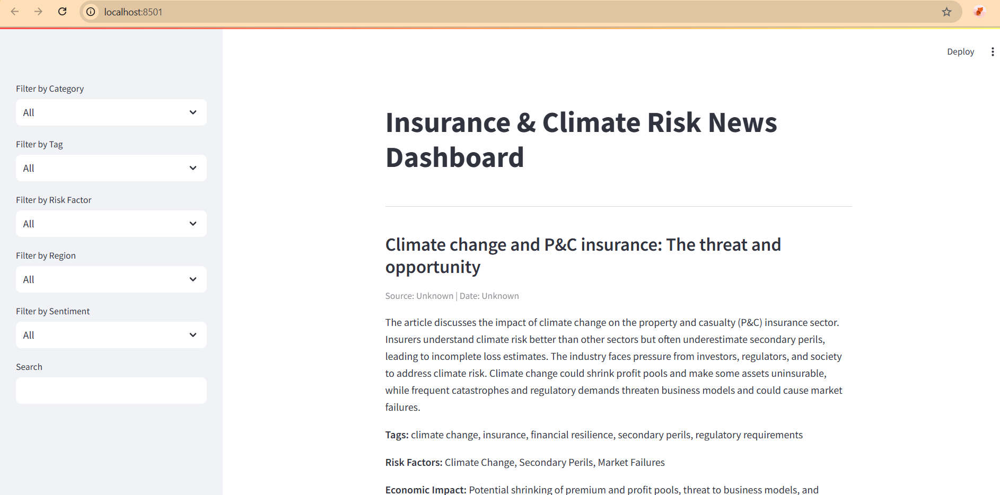
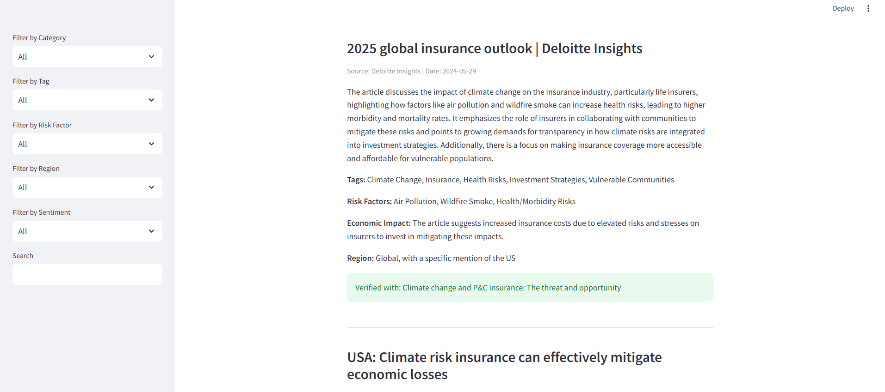
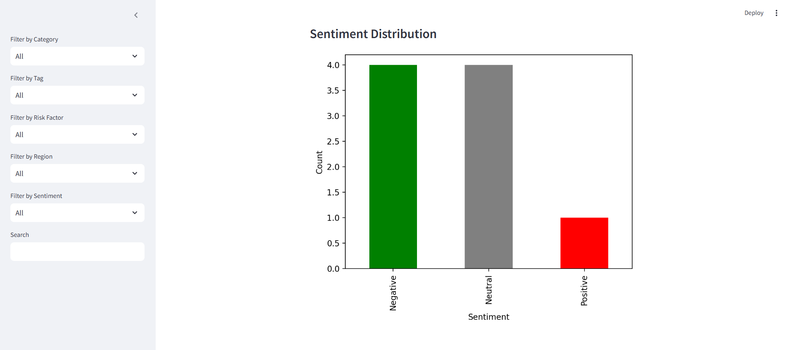

# Project Overview

## Insurance News Scraper 🚀

A Python-based tool that scrapes **insurance and reinsurance news**, processes them using **GPT-4o**, validates insights with research papers, and presents findings in an **interactive dashboard**.

## Features

✅ Fetches real-time news from **Tavily API**
✅ Summarizes & categorizes using **GPT-4o**
✅ Validates credibility with **research papers**
✅ Generates structured reports (JSON)
✅ Interactive dashboard with **Streamlit**

# Installation Guide

## Clone the Repository:

```env
git clone https://github.com/krishna-jajoo/insurance-news-scraper.git  
cd insurance-news-scraper
```

## Create a Virtual Environment & Install Dependencies

✅ **Windows**

```bash
python -m venv venv
venv\Scripts\activate  # On Windows
pip install -r requirements.txt
```

✅ **Mac/Linux**

```bash
python3 -m venv venv
source venv/bin/activate
pip install -r requirements.txt  
```

# **How to Run**

## API Keys

### 1. Get API Keys:

### 2. Set API Keys

Create a `.env` file inside the directory and add your API keys.

1) TAVILY_API_KEY
2) OPENAI_API_KEY

```env
OPENAI_API_KEY="your_openai_key"  
TAVILY_API_KEY="your_tavily_key"
```

## Run news processing:

```md
scripts\news_pipeline.bat
```

## Launch the dashboard:

```md
streamlit run ui/dashboard.py 
```

## Performance Metrics:

```md
python -m src.accuracy.performance_metrics
```

# Example:

1) Raw Json:
2) Structured Json
3) Validated Json
4) Dashboard View :

   Heading:
   Filter by Category
   Filter by tag:
   Filter By risk Factor
   Filter by region
   Filter By Sentiment



da



Sentiment Distribution



Example:
