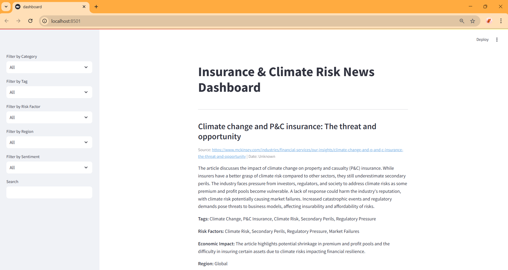
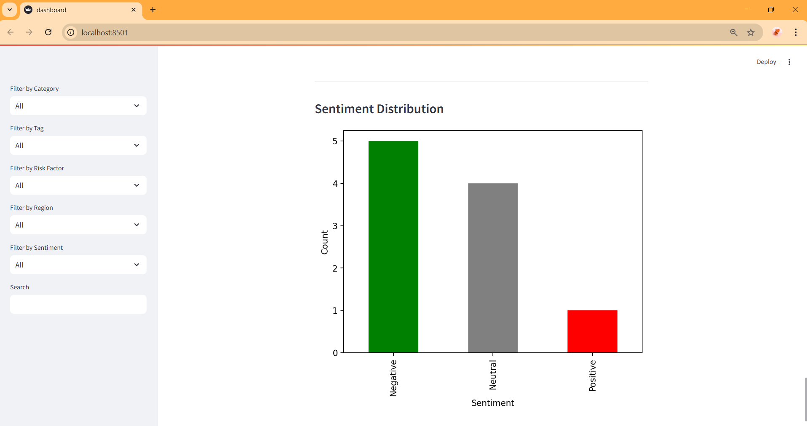
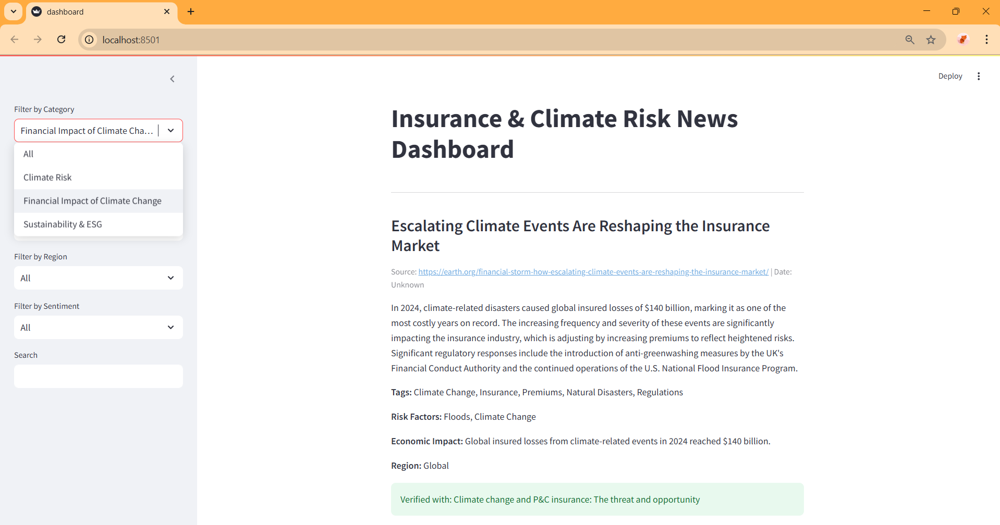
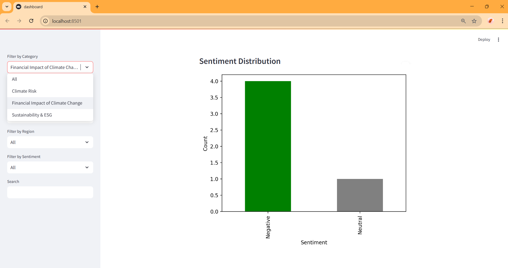
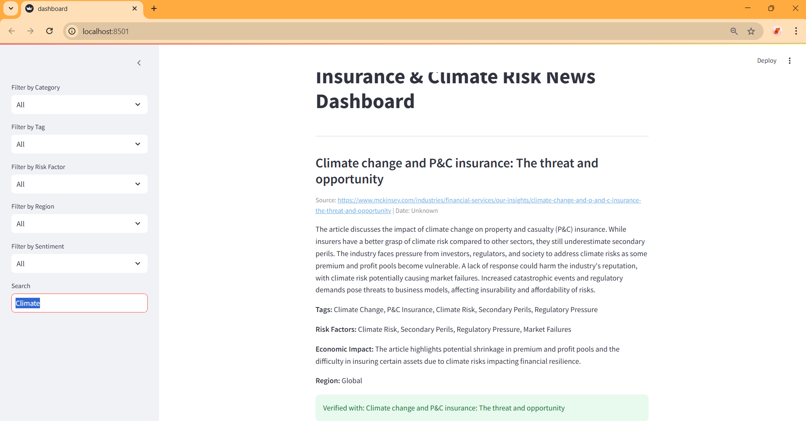
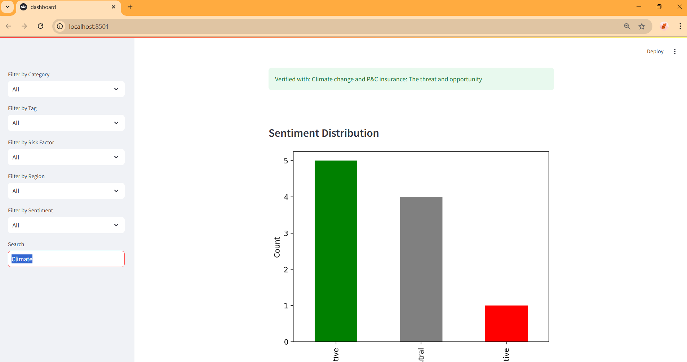

# Project Overview

## Insurance News Scraper 🚀

A Python-based tool that scrapes **insurance and reinsurance news**, processes them using **GPT-4o**, validates insights with research papers, and presents findings in an **interactive dashboard**.

## Features

✅ Fetches real-time news from **Tavily API**
✅ Summarizes & categorizes using **GPT-4o**
✅ Validates credibility with **research papers**
✅ Generates structured reports (JSON)
✅ Interactive dashboard with **Streamlit**

# Installation Guide

## Clone the Repository:

```env
git clone https://github.com/krishna-jajoo/insurance-news-scraper.git  
cd insurance-news-scraper
```

## Create a Virtual Environment & Install Dependencies

✅ **Windows**

```bash
python -m venv venv
venv\Scripts\activate  # On Windows
pip install -r requirements.txt
```

✅ **Mac/Linux**

```bash
python3 -m venv venv
source venv/bin/activate
pip install -r requirements.txt  
```

# **How to Run**

## API Keys

### 1. Get API Keys:

### 2. Set API Keys

Create a `.env` file inside the directory and add your API keys.

1) TAVILY_API_KEY
2) OPENAI_API_KEY

```env
OPENAI_API_KEY="your_openai_key"  
TAVILY_API_KEY="your_tavily_key"
```

## Run news processing:

✅ **Windows**

```bat
  scripts\news_pipeline.bat
```

✅ **Mac/Linux**

```bash
./scripts/news_pipeline.sh
```

## Launch the dashboard:

```python
streamlit run ui/dashboard.py 
```

## Performance Metrics:

```python
python -m src.accuracy.performance_metrics
```

# Example With Detailed Explantation:

### Raw Json:

📌 **Unprocessed data** fetched from the Tavily API.

This section outlines the processing pipeline for insurance-related news articles obtained via the **Tavily Search API** .

* The **raw JSON** is the initial unprocessed data fetched from the Tavily API.
* It includes fields like `title`, `url`, `content`, and a relevance `score`.

#### **How It Works**

 Fetches **latest insurance-related news** using Tavily search

* Fetches **latest insurance-related news** using Tavily search.
* Saves **unstructured data** in JSON format.
* Used as the **input** for further processing.

#### 📂 **[Sample Raw News JSON](example\raw_news.json)**

#### Example Raw JSON Output

```json
{
    "title": "Escalating Climate Events Are Reshaping the Insurance Market",
    "url": "https://earth.org/financial-storm-how-escalating-climate-events-are-reshaping-the-insurance-market/",
    "content": "2024 marked a pivotal moment in the escalating financial toll of climate change...",
    "score": 0.82220376
}
```

#### ⚙ **Data Collection Process**

* **Tavily API** fetches news using the query: `"Climate risk insurance impact"`.
* **Raw JSON** is saved in `outputs/raw_news.json`.
* **Next Step** : Process this data into  **structured JSON** .

### Structured Json:

📌 **Processed and categorized data** extracted from raw news articles using LLM.

This section describes the transformation of raw news data into a structured format using  **Gen-AI models** . The AI model extracts key insights, categorizes the news, and provides a concise summary relevant to climate risk and insurance.

* The **structured JSON** is the output generated after processing the raw news data.
* It includes fields like `title`, `summary`, `category`, `source`, `date`, `tags`, `risk_factors`, `economic_impact`, `geographical_region`, and `sentiment`.

#### **How It Works**

* Uses **Gen-AI** to analyze and extract structured insights.
* Summarizes news content and assigns an  **insurance category** .
* Identifies  **risk factors, economic impact, and sentiment** .
* Saves **structured data** in JSON format.

#### [📂 ](example\raw_news.json)**[SAMPLE STRUCTURED NEWS JSON](example\structured_news.json)**

```json
{
  "title": "Escalating Climate Events Are Reshaping the Insurance Market",
  "summary": "2024 saw a record $140B in insured losses, pushing insurers to raise premiums and reevaluate risk models.",
  "category": "Climate Risk",
  "source": "https://earth.org....",
  "date": "2024-03-15",
  "tags": ["Climate Change", "Insurance Premiums", "Financial Risk"],
  "risk_factors": ["Hurricanes", "Flooding", "Regulatory Challenges"],
  "economic_impact": "Insurance claims surged, causing financial strain on insurers.",
  "geographical_region": "Global",
  "sentiment": "Negative"
}

```

#### ⚙ **Data Processing Pipeline**

1. **Raw JSON** is processed using **Gen-AI models** to extract structured insights.
2. AI analyzes content for **key information** such as  **summary, category, risk factors, and sentiment** .
3. **Structured JSON** is saved in `outputs/structured_news.json`.
4. **Final Output** used for data analytics, visualization, and further research.

### Validated Json:

📌 **Cross-verified and validated news articles** backed by research papers.

This section describes the final stage in the **AI-ML Ideathon** workflow, where structured news articles are validated against research papers. This ensures that the extracted climate risk insights are backed by credible sources.

* The **validated JSON** is the final dataset, enriched with validation metadata.
* It includes fields like `title`, `summary`, `category`, `source`, `date`, `tags`, `risk_factors`, `economic_impact`, `geographical_region`, `sentiment`, `validated`, and `matched_research`.

#### **How It Works**

* Extracts **research papers dynamically** from the raw JSON dataset.
* Cross-checks **news articles with research papers** based on keyword matching.
* Assigns a `validated` status (`True` or `False`) depending on whether keywords from the news article are found in a research paper.
* If a match is found, the article is linked to the  **most relevant research paper** .
* Saves **validated data** in JSON format.

#### [📂 ](example\raw_news.json)**[SAMPLE VAIDATED NEWS JSON](example\validated_news.json)**

```json
{
    "title": "Escalating Climate Events Are Reshaping the Insurance Market",
    "summary": "In 2024, climate-related disasters caused global insured losses of $140 billion.....",
    "category": "Financial Impact of Climate Change",
    "source": "https://earth.org.....",
    "date": "Unknown",
    "tags": ["Climate Change", "Insurance", "Premiums", "Natural Disasters", "Regulations"],
    "risk_factors": ["Floods", "Climate Change"],
    "economic_impact": "Global insured losses from climate-related events in 2024 reached $140 billion.",
    "geographical_region": "Global",
    "sentiment": "Negative",
    "validated": true,
    "matched_research": "Climate change and P&C insurance: The threat and opportunity"
}

```

#### ⚙ **Validation Process**

1. **Extract Research Papers:**  Reads **raw research data** from `outputs/raw_news.json`. and extracts `title` and `content` fields from research papers.
2. **Match News with Research:** Compares **news article tags** against research paper content. If any tag from an article appears in a research paper, the article is considered  **validated** .
3. If a match is found, the article is marked as  **validated = True** , and the corresponding research paper is stored under `matched_research`.
4. **Validated JSON** is saved in `outputs/validated_news.json`.
5. **Final Output** is used for  **reliable climate risk analysis, decision-making, and reporting**

### News Dashboard View :

A **Streamlit-based dashboard** to **explore** validated news articles on climate risk & insurance.

#### **📌 Features**

✅ **Filter by Category** – Browse news by categories like **Financial Impact, Climate Policy, etc.**

✅ **Filter by Tag** – Find articles with specific **tags** such as `Climate Change, Insurance, Premiums, Natural Disasters`.

✅ **Filter by Risk Factor** – Select relevant **risk factors** such as `Floods, Wildfires, Economic Disruption`.

✅ **Filter by Region** – Focus on news from specific  **geographical regions** .

✅ **Filter by Sentiment** – Analyze articles based on  **Positive, Neutral, or Negative sentiment** .

✅ **Search by Keywords** – Instantly find articles based on  **title or summary text** .

✅ **Sentiment Distribution Chart** – Visualize the **sentiment breakdown** of news articles.

#### Dashboard View:



#### Sentiment Distribution Chart



#### Filtered by Category





#### Search by Keywords





# 👨‍💻About Me

Hi, I'm  **Krishna Jajoo** , a Data Scientist passionate about **AI-driven information extraction** and  **knowledge automation** . My expertise lies in  **Gen-AI, NLP, and knowledge graphs** , enabling me to build intelligent systems.

🔹 **Experience:** Data Scientist at Drishya AI Labs
🔹 **Skills:** Python, Prompt Engineering, Neo4j, LangChain, OCR
🔹 **Interest Areas:** AI/ML, NLP, Generative AI

📫 **Let's connect:**

- [LinkedIn](www.linkedin.com/in/krishna-jajoo-59a4951b4)
- [GitHub](https://github.com/krishna-jajoo)
- [Email](krishnajajoo09@gmail.com)
